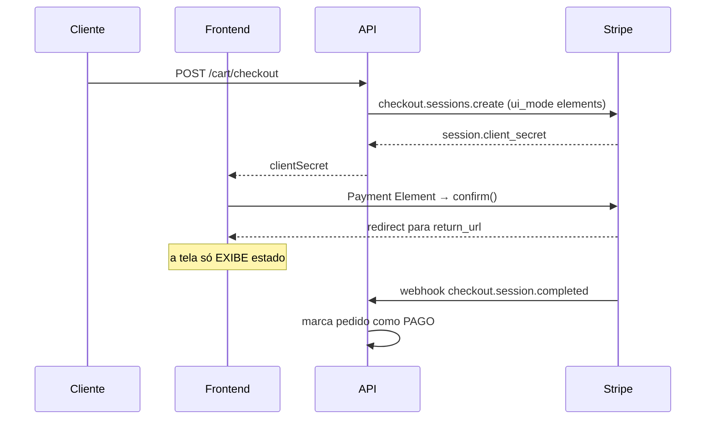

# Integrando o Stripe — manual prático

Manual de integração do Stripe escrito a partir da configuração real deste projeto
(NestJS + Next.js, Checkout Sessions com Payment Element, Pix e cartão em BRL).
Tudo que está aqui foi executado e verificado — inclusive os erros.

> **Quem deve ler:** quem vai configurar o Stripe neste repositório, ou quem vai montar
> uma integração parecida do zero em outro projeto.

---

## 1. O desenho da integração

A regra que organiza todo o resto:

> **Só o webhook confirma pagamento. A página de retorno nunca decide nada.**

Isso não é preciosismo. Pix fecha a sessão de Checkout *antes* do dinheiro chegar, e o
cliente pode fechar o navegador no meio do caminho. Se a confirmação morar na tela de
sucesso, você vai ter pedido pago sem confirmação e pedido confirmado sem pagamento.



### Onde cada peça mora

| Camada | Arquivo | Papel |
|---|---|---|
| Porta | `backend/src/modules/payments/domain/payment-gateway.ts` | contrato abstrato (`start`, `cancel`, `refund`) |
| Adaptador real | `.../infrastructure/stripe-payment.gateway.ts` | fala com a API do Stripe |
| Adaptador local | `.../infrastructure/fake-payment.gateway.ts` | Pix/cartão simulados, roda sem rede |
| Webhook | `.../presentation/payments.controller.ts` | `StripeWebhookController` |
| Seleção | `.../payments.module.ts` | `useFactory` escolhe pelo `PAYMENT_PROVIDER` |
| UI | `frontend/components/store/payment/stripe-payment.tsx` | Payment Element |

O ganho do par porta/adaptador: a aplicação inteira roda num notebook sem conta no
Stripe (`PAYMENT_PROVIDER=fake`), e trocar para o Stripe é mudar uma variável de
ambiente — nenhum `if (stripe)` espalhado pelo código de pedidos.

---

## 2. Seis decisões que valem copiar

### 2.1 Nunca passe `payment_method_types`

```ts
// ✅ assim — o Dashboard decide quais métodos aparecem
await stripe.checkout.sessions.create({
  ui_mode: 'elements',
  mode: 'payment',
  currency: 'brl',
  // sem payment_method_types
})
```

Passar `payment_method_types: ['card', 'pix']` **desliga** os métodos dinâmicos. Você
perde a capacidade de ligar um meio de pagamento novo pelo Dashboard, sem deploy, e o
Stripe perde a capacidade de ordenar os métodos por conversão para cada cliente.
Para restringir, use `payment_method_configurations` ou `excluded_payment_method_types`.

A única exceção é Terminal (presencial), que exige `payment_method_types: ['card_present']`.

### 2.2 `ui_mode: 'elements'` quando o checkout é seu

Três caminhos possíveis:

| Caminho | Quando usar |
|---|---|
| Checkout hospedado | você aceita a tela do Stripe e quer o mínimo de código |
| `ui_mode: 'elements'` + Payment Element | **este projeto** — o checkout é seu, com sua marca |
| PaymentIntents na mão | só quando os dois acima não dão conta |

Com `elements`, o Stripe devolve um `client_secret` e o Payment Element renderiza dentro
da sua página, aceitando tema customizado:

```tsx
const appearance = {
  theme: "night",
  variables: { colorPrimary: "#E5A900", colorBackground: "#0e0e0e", /* … */ },
}
```

### 2.3 `rawBody` é obrigatório para verificar assinatura

A verificação da assinatura usa HMAC sobre os **bytes exatos** do corpo. Se o Express
já parseou o JSON, o corpo foi reserializado e o hash nunca bate.

```ts
// backend/src/main.ts
const app = await NestFactory.create<NestExpressApplication>(AppModule, { rawBody: true });
```

```ts
// no controller
event = stripe.webhooks.constructEvent(req.rawBody, signature, webhookSecret);
```

Sintoma de quem esqueceu: webhook devolvendo `400 Assinatura inválida` para 100% dos
eventos, com as chaves todas corretas.

### 2.4 Falhe no boot, não no primeiro checkout

```ts
useFactory: (config: AppConfig) => {
  if (config.payments.provider === 'stripe') {
    if (!config.payments.stripeSecretKey || !config.payments.stripeWebhookSecret) {
      throw new Error('PAYMENT_PROVIDER=stripe requer STRIPE_SECRET_KEY e STRIPE_WEBHOOK_SECRET.');
    }
    return new StripePaymentGateway(config);
  }
  return new FakePaymentGateway();
}
```

Variável faltando derruba a API na inicialização, com mensagem clara. A alternativa é
descobrir em produção, no primeiro cliente que tentar pagar.

### 2.5 Chave restrita, não a secret key

Prefira uma **restricted key** (`rk_...`) à secret key (`sk_...`). Para esta integração,
as permissões necessárias são exatamente:

| Recurso | Permissão | Usado em |
|---|---|---|
| Checkout Sessions | Write | `create`, `retrieve`, `expire` |
| PaymentIntents | Read | descobrir o método usado |
| Charges | Read | `expand: ['latest_charge']` |
| Refunds | Write | cancelamento de pedido |

Uma `sk_` vazada dá acesso total à conta. Uma `rk_` com esse escopo, no pior caso,
cria sessões e emite reembolsos — ruim, mas limitado.

### 2.6 Em erro de pagamento, pergunte ao servidor — não classifique pelo código

Quando `confirm()` falha, há duas situações bem diferentes por trás:

- **recusa** — o pedido continua pagável, o cliente tenta outro cartão
- **sessão vencida** — o pedido não é mais pagável, o cliente precisa de um código novo

O erro do Stripe **não separa as duas de forma confiável**: a sessão vencida chega como
o erro genérico (`code: null`), sem campo que identifique a expiração. Classificar pelo
código é construir em cima de algo que não existe.

A informação confiável está no seu servidor — o webhook `checkout.session.expired` já
marcou o pagamento como morto. Então a tela não adivinha: ela revalida.

```tsx
const result = await state.checkout.confirm()
if (result.type === "error") {
  setMessage(paymentErrorMessage(result.error))
  onFailure?.()   // revalida /orders/{id}: se o pagamento morreu, a tela troca sozinha
}
```

```tsx
// na página
<StripePayment clientSecret={…} onFailure={() => void mutate()} />
```

O resultado: recusa mantém a mensagem específica e o formulário vivo; sessão vencida
leva o cliente direto para a tela de "gere um novo pagamento", em vez de deixá-lo
apertando um botão que nunca mais vai funcionar.

> Vale manter **também** um polling enquanto o pedido está aguardando pagamento
> (`refreshInterval` enquanto o status for `CART`). O `onFailure` cobre o clique; o
> polling cobre quem deixou a aba aberta sem tocar em nada.

O princípio generaliza para além do Stripe: **quando o provedor não distingue dois
estados que importam para você, não invente um classificador — consulte quem sabe.**

---

## 3. Configuração, passo a passo

### 3.1 Sandbox

Sandbox é o ambiente de teste isolado do Stripe. **Não** use o "test mode" compartilhado
da conta para desenvolver — use sandboxes separados por ambiente (local, CI).

```bash
npm i -g @stripe/cli

# já tem conta Stripe:
stripe login            # abre o navegador, você aprova o device e escolhe o sandbox

# não tem conta:
stripe sandbox create   # cria um ambiente de teste sem cadastro
```

Confirme onde você caiu:

```bash
stripe whoami --format json
# → "display_name": "...", "mode": "test"
```

> ⚠️ `stripe login` **não** entrega as chaves de API. Ele autoriza a CLI. A `rk_`/`sk_`
> e a `pk_` você pega no Dashboard, em **Developers › API keys**.

### 3.2 Métodos de pagamento no Dashboard

**Settings › Payments › Payment methods.** Ative cartão e, se for cobrar em BRL, Pix.
Como o código não fixa métodos, o que estiver ligado aqui é o que aparece na tela.

Confira pela API o que está realmente ligado:

```bash
stripe get /v1/payment_method_configurations
```

### 3.3 Variáveis de ambiente

`backend/.env`:

```env
PAYMENT_PROVIDER=stripe
STRIPE_SECRET_KEY=rk_test_...
STRIPE_WEBHOOK_SECRET=whsec_...
```

`frontend/.env.local`:

```env
NEXT_PUBLIC_STRIPE_PUBLISHABLE_KEY=pk_test_...
```

Confirme que os dois arquivos estão cobertos pelo `.gitignore`:

```bash
git check-ignore -v backend/.env frontend/.env.local
```

### 3.4 Webhook local

```bash
stripe listen --forward-to localhost:3333/api/webhooks/stripe
```

Ele imprime o `whsec_...` → vai para `STRIPE_WEBHOOK_SECRET`. Para ver o segredo sem
deixar um processo rodando:

```bash
stripe listen --print-secret
```

Filtrar só os eventos que você trata deixa o log legível:

```bash
stripe listen --forward-to localhost:3333/api/webhooks/stripe \
  --events checkout.session.completed,checkout.session.async_payment_succeeded,\
checkout.session.async_payment_failed,checkout.session.expired,refund.created,refund.updated
```

### 3.5 Webhook em produção

**Developers › Webhooks › Add endpoint** → `https://SEU_DOMINIO/api/webhooks/stripe`,
assinando os seis eventos acima. O `whsec_` desse endpoint é **diferente** do local.

---

## 4. Os seis eventos, e por que cada um existe

```ts
switch (event.type) {
  case 'checkout.session.completed':
  case 'checkout.session.async_payment_succeeded': {
    const session = event.data.object;
    // Pix fecha a sessão antes do dinheiro chegar: só cumpra quando pago.
    if (session.payment_status !== 'unpaid') {
      const method = await this.gateway.methodOfSession(session);
      await this.payments.markSucceeded(session.id, method);
    }
    break;
  }
  case 'checkout.session.async_payment_failed':
    await this.payments.markFailed(event.data.object.id, 'FAILED');
    break;
  case 'checkout.session.expired':
    await this.payments.markFailed(event.data.object.id, 'CANCELED');
    break;
  case 'refund.created':
  case 'refund.updated': {
    const refund = event.data.object;
    if (refund.status === 'succeeded') await this.payments.completeRefundByProviderId(refund.id, true);
    else if (refund.status === 'failed' || refund.status === 'canceled')
      await this.payments.completeRefundByProviderId(refund.id, false);
    break;
  }
}
```

| Evento | Quando dispara | O que fazemos |
|---|---|---|
| `checkout.session.completed` | cartão aprovado, ou sessão Pix fechada | cumpre **se** `payment_status !== 'unpaid'` |
| `checkout.session.async_payment_succeeded` | Pix liquidou | cumpre o pedido |
| `checkout.session.async_payment_failed` | Pix não foi pago | marca pagamento como falho |
| `checkout.session.expired` | sessão venceu ou foi expirada | devolve o pedido ao carrinho |
| `refund.created` / `refund.updated` | reembolso criado/atualizado | fecha o reembolso no banco |

**O detalhe que separa quem já apanhou de quem não apanhou:** a guarda
`payment_status !== 'unpaid'` dentro do `completed`. Sem ela, todo pedido Pix é marcado
como pago no instante em que o cliente vê o QR — antes de qualquer dinheiro existir.

### Descobrir o método de verdade

O cliente escolhe no Payment Element, então o método que você gravou no checkout é só
um palpite. O real vem do charge:

```ts
const pi = await stripe.paymentIntents.retrieve(piId, { expand: ['latest_charge'] });
const details = pi.latest_charge?.payment_method_details;
if (details?.type === 'pix') return 'PIX';
if (details?.type === 'card') return details.card?.funding === 'debit' ? 'DEBIT_CARD' : 'CREDIT_CARD';
```

---

## 5. Testando de verdade

`stripe trigger` prova que o túnel funciona. **Não prova que a integração funciona** —
ele fabrica um evento com dados sintéticos que não correspondem a nenhum pedido seu.
Para validar de verdade, passe pelo fluxo real.

### 5.1 Cartão

Cartão `4242 4242 4242 4242`, validade futura, CVC qualquer. Débito (para checar a
classificação `DEBIT_CARD`): `4000 0566 5566 5556`.

O que você deve ver no terminal do `stripe listen`:

```
--> checkout.session.completed [evt_...]
<-- [200] POST http://localhost:3333/api/webhooks/stripe
```

E no pedido:

```json
{"status":"PAID","payment":{"status":"SUCCEEDED","method":"CREDIT_CARD"}}
```

### 5.2 Pix

A tela mostra o QR com um botão **"Simular digitalização"** (só em test mode).

> ⏱️ **O Pix do sandbox leva ~3 minutos para liquidar.** Durante esse tempo o
> PaymentIntent fica em `requires_action` e isso está **certo** — é exatamente o
> comportamento assíncrono que o `async_payment_succeeded` existe para tratar.
> Não conclua que a simulação falhou porque 30 segundos de polling não mudaram nada.

Resultado esperado:

```json
{"status":"PAID","paymentMethod":"PIX","payment":{"method":"PIX"}}
// stripe: latest_charge.payment_method_details.type === "pix"
```

### 5.3 Reembolso

Cancele um pedido pago. Devem chegar dois eventos:

```
--> refund.created [evt_...]   <-- [200]
--> refund.updated [evt_...]   <-- [200]
```

Um sinal de que o webhook — e não a chamada síncrona — fechou o reembolso: o
`completedAt` fica alguns segundos depois do `createdAt`.

### 5.4 Expiração

Chame o checkout duas vezes para o mesmo pedido: o gateway expira a sessão anterior,
chega `checkout.session.expired`, e o pedido **volta para o carrinho** em vez de ficar
preso num limbo de "aguardando pagamento". Vale testar — é o caminho que protege o
cliente que abandona o pagamento no meio.

### 5.5 Automatizando com Playwright

O Payment Element vive num iframe do Stripe. Dois detalhes que custam tempo:

```python
# os campos estão num iframe, não no documento principal
fr = page.frame_locator("iframe[name^='__privateStripeFrame']").first
fr.get_by_placeholder("1234 1234 1234 1234").fill("4242424242424242")
fr.get_by_placeholder("MM / AA").fill("12 / 30")
fr.get_by_placeholder("CVC").fill("123")

# o modal do QR do Pix vive em OUTRO frame (payments.stripe.com)
for f in page.frames:
    loc = f.get_by_text("Simular digitalização", exact=False).first
    if loc.count() > 0:
        loc.click()
        break
```

---

## 6. Armadilhas verificadas

Cada linha abaixo custou tempo real de depuração.

### `payment_method_configurations` ligado ≠ método disponível

A configuração pode listar `pix: on` **e mesmo assim** o Pix não funcionar em produção.
São duas coisas diferentes:

- **payment method configuration** — o que você quer exibir
- **account capability** — o que o Stripe te autorizou a cobrar

Com a conta não ativada, o Stripe.js avisa só no console do navegador:

```
[Stripe.js] The following payment method types are not activated: pix.
They will be displayed in test mode, but hidden in live mode.
```

Em sandbox tudo parece certo. Em live, a aba simplesmente não aparece. Verifique as
capabilities, não a configuração:

```bash
stripe get /v1/accounts/acct_XXX
# charges_enabled: false, details_submitted: false, capabilities: {} → ainda não dá
```

### A tela do Stripe sai em inglês — e `locale` só resolve metade

Sem configurar nada, o Payment Element segue o idioma do navegador. Um cliente
brasileiro com Chrome em inglês vê a aba **"Card"** e **"You will be shown a QR code to
scan to complete your purchase."** no meio de uma loja em português.

A pegadinha é *onde* o locale mora. Em Checkout Elements, `elementsOptions` **não aceita**
o campo — ele existe só no construtor do Stripe.js:

```ts
// ❌ ignorado silenciosamente
<CheckoutElementsProvider options={{ clientSecret, elementsOptions: { appearance, locale: "pt-BR" } }}>

// ✅ no construtor
const stripePromise = loadStripe(key, { locale: "pt-BR" })
```

**Isso traduz a UI, mas não as mensagens de recusa** — essas vêm da API, não do Elements,
e chegam em inglês de qualquer jeito (`The payment attempt failed.`). Traduza pelo
`declineCode`, que é estável, em vez de tentar casar a string:

```ts
// o erro do confirm() tem este formato
type ConfirmError =
  | { message: string; code: 'paymentFailed'; paymentFailed: { declineCode: string | null } }
  | { message: string; code: null }

const DECLINE_MESSAGES: Record<string, string> = {
  insufficient_funds: "Saldo insuficiente. Tente outro cartão ou pague com Pix.",
  expired_card: "Esse cartão está vencido. Confira a validade ou use outro.",
  incorrect_cvc: "O código de segurança não confere. Confira o CVC.",
  // …
}
```

> 🔒 **Não traduza `lost_card` nem `stolen_card`.** Deixe cair na mensagem genérica.
> Dizer "este cartão foi reportado como roubado" entrega a informação justamente a quem
> está usando o cartão de outra pessoa.

Para testar que o português vem do seu código e não do navegador, force o contexto em
inglês:

```python
ctx = browser.new_context(locale="en-US")   # se ainda aparecer pt-BR, o locale é seu
```

### `.env` não recarrega com `--watch`

`nest start --watch` recompila o TypeScript, mas as variáveis de ambiente são lidas uma
vez, no boot. Trocar `PAYMENT_PROVIDER` e salvar não faz nada — é preciso reiniciar o
processo. Sintoma: `/api/payments/config` continua devolvendo `{"provider":"fake"}`
depois de você ter certeza de ter mudado o `.env`.

### A sessão só ganha `payment_intent` depois de confirmada

Logo após `sessions.create`, `session.payment_intent` é `null`. Se o seu script de teste
lê o PI nesse momento e começa a observá-lo, ele vai observar `None` para sempre.
Releia a sessão depois da confirmação.

### Git Bash come o `/` inicial dos argumentos

No Windows, `stripe get /v1/accounts/...` vira `/v1/C:/Program Files/Git/v1/...`.
Desligue a conversão de caminhos:

```bash
MSYS_NO_PATHCONV=1 stripe get /v1/accounts/acct_XXX
```

### A versão de API dos eventos é a da conta

O SDK Node fixa sua própria versão nas chamadas que *você* faz, mas os eventos chegam
na versão default da **conta** (`Developers › API versions`). As duas podem divergir sem
quebrar nada — mas é bom saber qual é qual quando um campo não aparece onde você esperava.

---

## 7. Checklist antes de ir para produção

- [ ] Conta ativada: `charges_enabled: true` e as capabilities concedidas (`card_payments`, `pix_payments`)
- [ ] Métodos conferidos **em live**, não só no sandbox
- [ ] Chaves de live no lugar das de teste — e `rk_` em vez de `sk_`
- [ ] Endpoint de webhook criado no ambiente live, com o `whsec_` de produção
- [ ] `FRONTEND_URL` com o domínio real (o `return_url` é montado a partir dele)
- [ ] `COOKIE_SECURE=true`
- [ ] `.env` fora do versionamento (`git check-ignore -v`)
- [ ] Fluxo completo testado: cartão, Pix, reembolso e expiração
- [ ] `locale` no `loadStripe` e mensagens de recusa traduzidas — teste com o navegador em `en-US`
- [ ] Sessão vencida leva o cliente a gerar um pagamento novo, em vez de um botão morto (§2.6)
- [ ] Logs do webhook monitorados — um endpoint devolvendo 500 faz o Stripe reenviar e, depois, desistir

---

## 8. Referência rápida

```bash
# autenticação
stripe login                       # device code, abre o navegador
stripe sandbox create              # ambiente de teste sem cadastro
stripe whoami --format json        # onde eu estou?

# webhook
stripe listen --forward-to localhost:3333/api/webhooks/stripe
stripe listen --print-secret       # só o whsec_, sem segurar o terminal

# inspeção (prefixe com MSYS_NO_PATHCONV=1 no Git Bash)
stripe get /v1/accounts/acct_XXX
stripe get /v1/payment_method_configurations
stripe get /v1/checkout/sessions --limit 3
stripe get /v1/refunds --limit 3

# documentação (melhor que curl)
stripe docs /payments/pix
stripe docs search "payment intents"
stripe docs api POST /v1/checkout/sessions
```

### Cartões de teste

| Número | Resultado |
|---|---|
| `4242 4242 4242 4242` | aprovado (crédito) |
| `4000 0566 5566 5556` | aprovado (débito) |
| `4000 0000 0000 9995` | recusado por saldo insuficiente |
| `4000 0025 0000 3155` | exige autenticação 3D Secure |

---

## 9. Para ler depois

- [Integration options](https://docs.stripe.com/payments/payment-methods/integration-options.md) — começa aqui ao desenhar qualquer integração
- [Sandboxes](https://docs.stripe.com/sandboxes.md)
- [Chaves de API](https://docs.stripe.com/keys.md#manage-your-api-keys)
- [Payment method configurations](https://docs.stripe.com/payments/payment-method-configurations.md)
- [Go-live checklist](https://docs.stripe.com/get-started/checklist/go-live.md)
